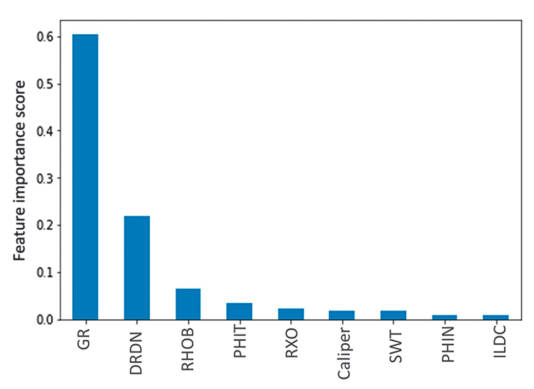
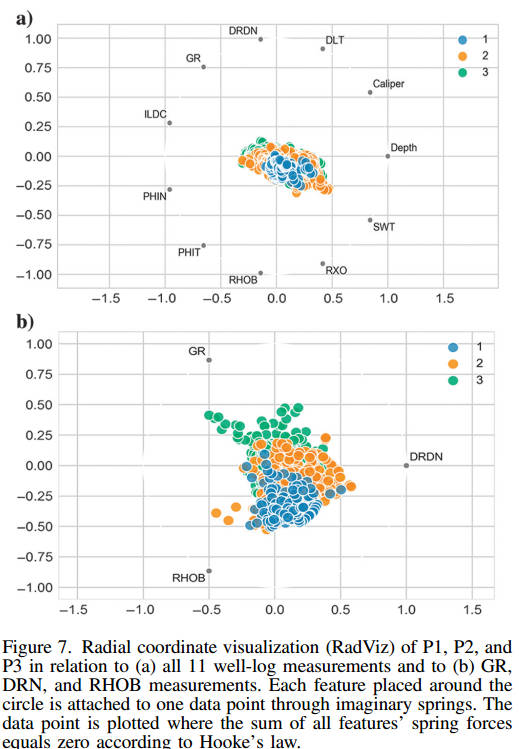
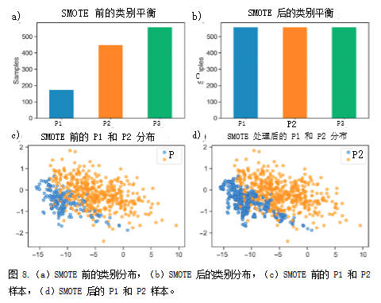
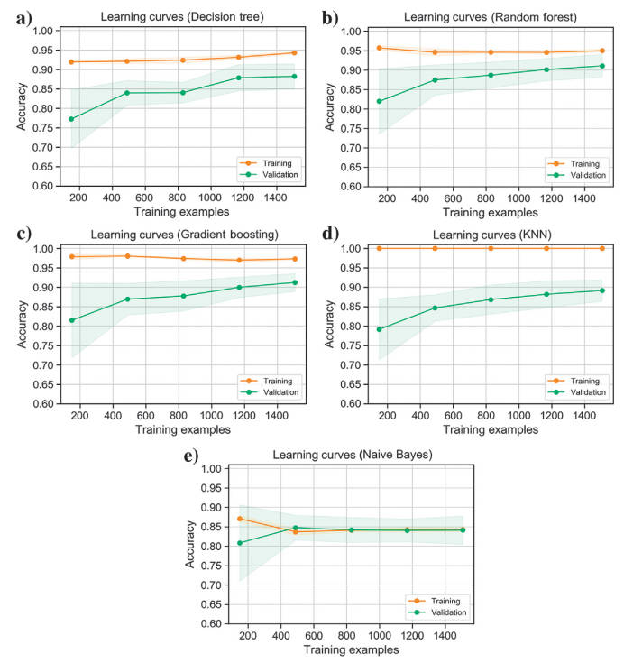

# Petrofacies classification using machine learning algorithms（利用机器学习算法进行岩相分类）

#### 目标

对巴西东南部坎波斯盆地某碳酸盐储层进行岩相分类

模型：决策树，随机森林，梯度提升，k近邻，朴素贝叶斯

数据集：来自两口威尔斯井的1477个电缆数据（A3和A10）

**处理前的数据维度**

**数据预处理后的数据维度**

DRDN负值（从密度[RHOB]和中子[PHIN]测井的归一化计算的参数）指示砂岩的存在，而正值表示其它岩性

**考虑在每个井的每个深度d处的一组三个标量特征：GR、DRDN和RHOB。**

当所有维度都加上后，结果数量分布特征不明显，在选取的三个相关性较高的维度中，结果数量分布特征较为明显

数据过采样(SMOTE)

#### 模型结果

对于RF和GB，随着训练集大小的增加，模型不再能够完美地拟合训练集，从而降低了训练精度。然而，模型更好地拟合了验证集，因为它是用更多的数据训练的。因此，验证分数随着更多的训练点的增加而增加。训练和验证曲线之间的小差距表明DT，RF，KNN模型在200个训练样本时出现过拟合现象;该模型专门用于训练数据集，导致泛化能力差，因此验证精度低。然而，该模型倾向于通过增加训练集中的样本来提高验证精度。另外，NB模型呈现的训练和验证曲线与其他模型相比在相对较低的分数处彼此接近，显示由高偏差引起的欠拟合。通常发生在模型过于简单并且可能无法捕获数据集的复杂性时。

#### 结果

两个井集的结果表明，基于树的集成方法在盲测域中，GB和RF分类器是最好的岩相分类器，最好的预测能力应该与多个弱分类器（DT）的组合相关联。（图11），RF性能优于GB，除了在1840 m的深度。（图12），GB显示了最好的相关性。

