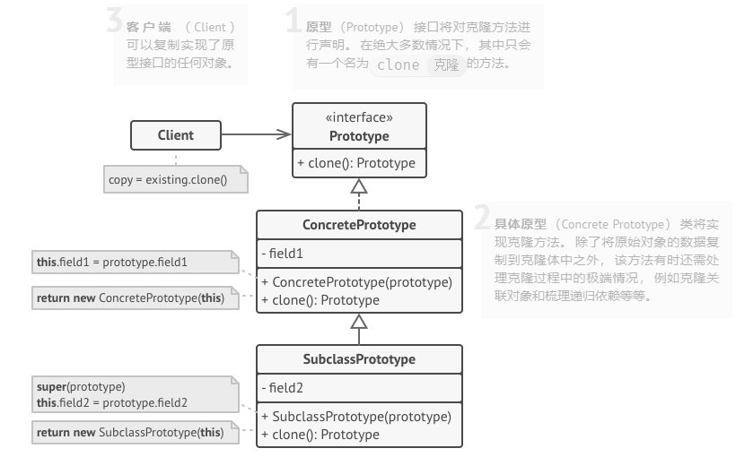

# 原型模式

**原型模式是一种创建型设计模式， 使你能够复制已有对象， 而又无需使代码依赖它们所属的类。**

## Tips

1.感觉原型设计模式就是通过克隆的方法创建新的对象
2.使用原型克隆出来的新对象不一定是通过`new()`出来的。存在一些可以避开`new()`方法创建对象的途径
  
```csharp
    //通过指定nonPublic和bindingAttr参数，可以创建不执行构造函数的对象
    object instance = Activator.CreateInstance(
    type,
    nonPublic: false,  // 不使用非公共构造函数
    bindingAttr: BindingFlags.CreateInstance | 
                 BindingFlags.Instance | 
                 BindingFlags.Public,
    binder: null,
    args: null,        // 不传递构造参数
    culture: null
    );
```

```csharp
   //创建一个未初始化的对象（所有字段为默认值，不执行任何构造函数）
   T instance = (T)FormatterServices.GetUninitializedObject(typeof(T));
```

3. C#中的浅拷贝

  ```csharp
  //执行浅拷贝
  this.MemberwiseClone()
  ```

## 问题

如果你有一个对象， 并希望生成与其完全相同的一个复制品， 你该如何实现呢？ 首先， 你**必须新建一个属于相同类的对象**。 然后， 你必须遍历原始对象的所有成员变量， 并将成员变量值复制到新对象中。

不错！ 但有个小问题。 并非所有对象都能通过这种方式进行复制， 因为有些对象可能拥有**私有**成员变量， 它们在对象本身以外是不可见的。

直接复制还有另外一个问题。 因为你**必须知道对象所属的类才能创建复制品， 所以代码必须依赖该类**。 即使你可以接受额外的依赖性， 那还有另外一个问题： ***<font color = "red">有时你只知道对象所实现的接口， 而不知道其所属的具体类***</font>， 比如可向方法的某个参数传入实现了某个接口的任何对象。

## 原型模式结构



#### 角色

- **原型 （Prototype）** 接口将对克隆方法进行声明。 在绝大多数情况下， 其中只会有一个名为 `clone`克隆的方法。
- **具体原型 （Concrete Prototype）** 类将实现克隆方法。 除了将原始对象的数据复制到克隆体中之外， 该方法有时还需处理克隆过程中的极端情况， 例如克隆关联对象和梳理递归依赖等等。
- **客户端 （Client）** 可以复制实现了原型接口的任何对象。
- **原型注册表 （Prototype Registry）** 提供了一种访问常用原型的简单方法， 其中存储了一系列可供随时复制的预生成对象。 最简单的注册表原型是一个 `名称 → 原型`的哈希表。 但如果需要使用名称以外的条件进行搜索， 你可以创建更加完善的注册表版本。
  
## 优缺点

| 优点                                              | 缺点                                       |
| ------------------------------------------------- | ------------------------------------------ |
| 你可以克隆对象， 而无需与它们所属的具体类相耦合。 | 克隆包含循环引用的复杂对象可能会非常麻烦。 |
| 你可以克隆预生成原型， 避免反复运行初始化代码。   |                                            |
| 你可以更方便地生成复杂对象。                      |                                            |
| 你可以用继承以外的方式来处理复杂对象的不同配置。  |                                            |

#### 原型模式（克隆）与使用默认参数的构造方法创建对象的区别

| 原型模式（复制）                 | new()（新建）                    |
| -------------------------------- | -------------------------------- |
| 基于已有原型对象克隆，复用其状态 | 调用构造函数，全新初始化一个对象 |
| 重点是 **“复制已有状态”**        | 重点是 **“执行初始化逻辑”**      |

- 通过原型创建的客户端与原型的关系取决于克隆的方式（深\浅拷贝）
- `new()`每次调用都会重新执行构造函数，按**逻辑初始化属性**

##### 适用场景对比

| 原型模式（克隆）                          | new()（新建）                      |
| ----------------------------------------- | ---------------------------------- |
| 已有复杂配置对象，需快速复制              | 需严格初始化流程（如依赖注入）     |
| 避免重复执行构造函数的高成本逻辑          | 需要 “干净初始状态” 的对象         |
| 动态生成对象（运行时调整原型后克隆）      | 类构造简单，无需复用已有状态       |
| 不执行构造函数（或仅执行浅 / 深克隆逻辑） | 执行构造函数（包括所有初始化代码） |

### **克隆的底层机制**

**不同语言的克隆实现方式：**

- **浅克隆**：复制对象的字段值（引用类型字段共享同一个实例）。
- **深克隆**：递归复制所有引用类型字段，创建完全独立的对象。
- **实现方式**：
  - **反射**：通过反射创建同类型对象，然后复制字段值（无需调用构造函数）。
  - **序列化**：将对象序列化为字节流，再反序列化为新对象（如 C# 的 `BinaryFormatter`）。
  - **手动实现**：在 `Clone()` 方法中显式创建新对象并复制属性（使用`new()`创建新对象）。