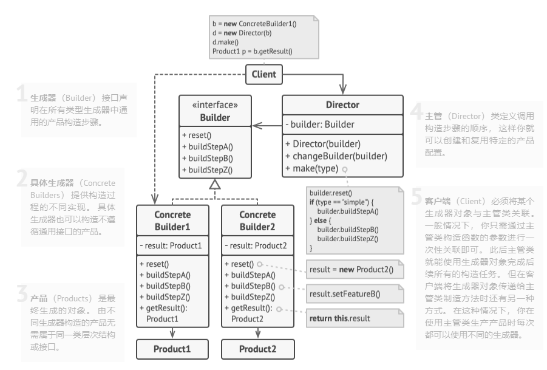

# 生成器模式

> **个人理解：** 一个对象的创建过程比较复杂，需要多个步骤，并且这些步骤的顺序不一定固定，这时候就可以使用生成器模式。生成器模式会将对象的创建过程拆分成多个步骤，每个步骤由一个单独的函数负责，这样就可以灵活地控制对象的创建过程。所谓的主管（Director）则是充当一个工具类，这个类中会定义好一些具体创建的步骤顺序，然后外部只需要调用其中具体的某一个方法即可，这样就会创建好一个对象。

生成器模式是一种创建型设计模式， 使你能够分步骤创建复杂对象。 该模式允许你使用相同的创建代码生成不同类型和形式的对象。

## 生成器模式结构

| 优点                                                          | 缺点                                                      |
| ------------------------------------------------------------- | --------------------------------------------------------- |
| 你可以分步创建对象， 暂缓创建步骤或递归运行创建步骤。         | 由于该模式需要新增多个类， 因此代码整体复杂程度会有所增加 |
| 生成不同形式的产品时， 你可以复用相同的制造代码               |                                                           |
| 单一职责原则。 你可以将复杂构造代码从产品的业务逻辑中分离出来 |                                                           |