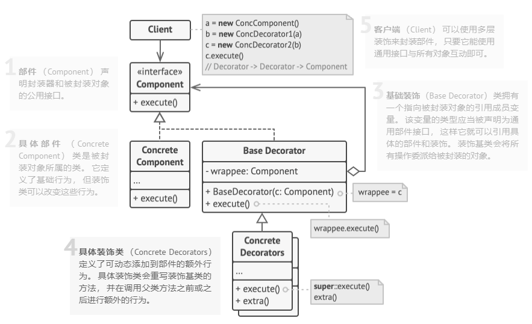

# 装饰模式（Decorator）  

**装饰模式**是一种结构型设计模式， 允许你通过将对象放入包含行为的特殊封装对象中来为原对象绑定新的行为。


#### 个人理解

> 有两个概念，一个是基础类，另一个是装饰类，装饰类是对基础对象进行装饰（扩展），装饰类和基础类都实现同一个接口，然后装饰类中持有对共同接口的引用，即装饰类中存储的引用即可能是基础类，也可能是另一个装饰类，通过这种方式，可以无限扩展，即装饰类可以嵌套(像俄罗斯套娃)。类似于组合模式。

## 装饰模式结构图



**部件 （Component）** 声明封装器和被封装对象的公用接口。
**具体部件 （Concrete Component）** 类是被封装对象所属的类。 它定义了基础行为， 但装饰类可以改变这些行为。
**基础装饰 （Base Decorator）** 类拥有一个指向被封装对象的引用成员变量。 该变量的类型应当被声明为通用部件接口， 这样它就可以引用具体的部件和装饰。 装饰基类会将所有操作委派给被封装的对象。
**具体装饰类 （Concrete Decorators）** 定义了可动态添加到部件的额外行为。 具体装饰类会重写装饰基类的方法， 并在调用父类方法之前或之后进行额外的行为。
**客户端 （Client）** 可以使用多层装饰来封装部件， 只要它能使用通用接口与所有对象互动即可。

## 适用场景

- 客户端 （Client） 可以使用多层装饰来封装部件， 只要它能使用通用接口与所有对象互动即可。
- 如果用继承来扩展对象行为的方案难以实现或者根本不可行， 你可以使用该模式。
  
## 优缺点

| 优点                                                                  | 缺点                                     |
| --------------------------------------------------------------------- | ---------------------------------------- |
| 你无需创建新子类即可扩展对象的行为                                    | 在封装器栈中删除特定封装器比较困难       |
| 你可以在运行时添加或删除对象的功能                                    | 实现行为不受装饰栈顺序影响的装饰比较困难 |
| 你可以用多个装饰封装对象来组合几种行为                                | 各层的初始化配置代码看上去可能会很糟糕   |
| 单一职责原则。 你可以将实现了许多不同行为的一个大类拆分为多个较小的类 |                                          |

## 代码示例

```csharp
 /// <summary>
 /// 组件接口
 /// </summary>
 public interface ICoffee
 {
     string GetDescription();
     double GetCost();
 }

 #region 具体组件
 public class Espresso : ICoffee
 {
     public double GetCost() => 1.99;

     public string GetDescription() => "Espresso";
 }

 public class HouseBlend : ICoffee
 {
     public string GetDescription() => "House Blend Coffee";
     public double GetCost() => 0.89;
 }
 #endregion

 #region 装饰器抽象类
 public abstract class CondimentDecorator : ICoffee
 {
     protected readonly ICoffee _coffee;
     public CondimentDecorator(ICoffee coffee)
     {
         _coffee = coffee;
     }

     public virtual string GetDescription() => _coffee.GetDescription();
     public virtual double GetCost() => _coffee.GetCost();
 }
 #endregion

 #region 具体装饰器
 public class Mocha : CondimentDecorator
 {
     public Mocha(ICoffee coffee) : base(coffee)
     {

     }

     public override string GetDescription()
     {
         return $"{_coffee.GetDescription()}, Mocha";    
     }
     public override double GetCost()
     {
         return _coffee.GetCost() + 0.20;
     }
 }

 public class Whip : CondimentDecorator
 {
     public Whip(ICoffee coffee) : base(coffee)
     {

     }

     public override string GetDescription()
     {
         return $"{_coffee.GetDescription()}, Whip ";
     }
     public override double GetCost()
     {
         return _coffee.GetCost() + 0.10;
     }
 }

 public class Soy : CondimentDecorator
 {
     public Soy(ICoffee coffee) : base(coffee) { }

     public override string GetDescription() => $"{_coffee.GetDescription()}, Soy";
     public override double GetCost() => _coffee.GetCost() + 0.15;
 }
 #endregion


 Main(){
    //基础咖啡
    ICoffee coffee = new Espresso();
    Console.WriteLine($"{coffee.GetDescription()} = ${coffee.GetCost()}");

    //装饰咖啡
    coffee = new Mocha(coffee);
    coffee = new Mocha(coffee);
    coffee = new Whip(coffee);
    Console.WriteLine($"{coffee.GetDescription()} = ${coffee.GetCost()}");

    ICoffee houseBlend = new HouseBlend();
    houseBlend = new Soy(houseBlend);
    houseBlend = new Whip(houseBlend);
    Console.WriteLine($"{houseBlend.GetDescription()} = ${houseBlend.GetCost()}");
 }
```

输出结果：

```csharp
Espresso = $1.99
Espresso, Mocha, Mocha, Whip = $2.39
House Blend Coffee, Soy, Whip = $1.04
``` 
