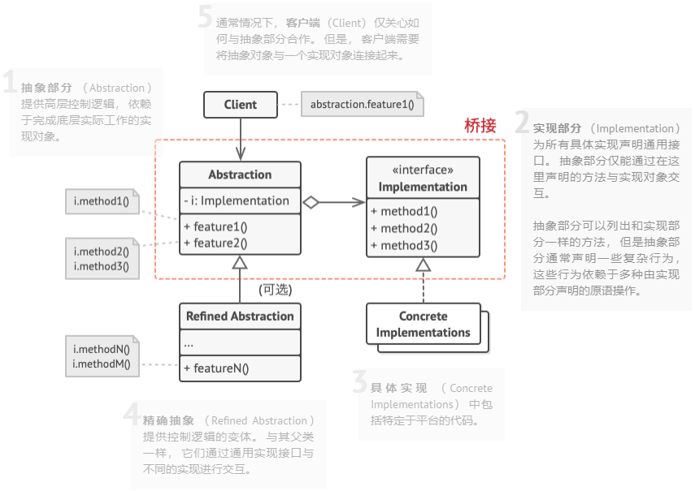

# 桥接模式（Bridge）

**桥接模式**是一种结构型设计模式， 可将一个大类或一系列紧密相关的类拆分为抽象和实现两个独立的层次结构， 从而能在开发时分别使用。

桥接模式通过将继承改为组合的方式，就是抽取其中一个维度并使之成为独立的类层次， 这样就可以在初始类中引用这个新层次的对象， 从而使得一个类不必拥有所有的状态和行为。

## 桥接模式结构



1. **抽象部分** （Abstraction） 提供高层控制逻辑， 依赖于完成底层实际工作的实现对象。
2. **实现部分** （Implementation） 为所有具体实现声明通用接口。 抽象部分仅能通过在这里声明的方法与实现对象交互。
抽象部分可以列出和实现部分一样的方法， 但是抽象部分通常声明一些复杂行为， 这些行为依赖于多种由实现部分声明的原语操作。
3. **具体实现** （Concrete Implementations） 中包括特定于平台的代码。
4. **精确抽象** （Refined Abstraction） 提供控制逻辑的变体。 与其父类一样， 它们通过通用实现接口与不同的实现进行交互。
5. **客户端** （Client） 仅关心如何与抽象部分合作。 但是， 客户端需要将抽象对象与一个实现对象连接起来。

## 优缺点

| 优点                                                             | 缺点                                       |
| ---------------------------------------------------------------- | ------------------------------------------ |
| 你可以创建与平台无关的类和程序                                   | 对高内聚的类使用该模式可能会让代码更加复杂 |
| 客户端代码仅与高层抽象部分进行互动， 不会接触到平台的详细信息    |                                            |
| 开闭原则。 你可以新增抽象部分和实现部分， 且它们之间不会相互影响 |                                            |
| 单一职责原则。 抽象部分专注于处理高层逻辑， 实现部分处理平台细节 |                                            |

## 伪代码

```csharp
// “抽象部分”定义了两个类层次结构中“控制”部分的接口。它管理着一个指向“实
// 现部分”层次结构中对象的引用，并会将所有真实工作委派给该对象。
class RemoteControl is
    protected field device: Device
    constructor RemoteControl(device: Device) is
        this.device = device
    method togglePower() is
        if (device.isEnabled()) then
            device.disable()
        else
            device.enable()
    method volumeDown() is
        device.setVolume(device.getVolume() - 10)
    method volumeUp() is
        device.setVolume(device.getVolume() + 10)
    method channelDown() is
        device.setChannel(device.getChannel() - 1)
    method channelUp() is
        device.setChannel(device.getChannel() + 1)


// 你可以独立于设备类的方式从抽象层中扩展类。
class AdvancedRemoteControl extends RemoteControl is
    method mute() is
        device.setVolume(0)


// “实现部分”接口声明了在所有具体实现类中通用的方法。它不需要与抽象接口相
// 匹配。实际上，这两个接口可以完全不一样。通常实现接口只提供原语操作，而
// 抽象接口则会基于这些操作定义较高层次的操作。
interface Device is
    method isEnabled()
    method enable()
    method disable()
    method getVolume()
    method setVolume(percent)
    method getChannel()
    method setChannel(channel)


// 所有设备都遵循相同的接口。
class Tv implements Device is
    // ……

class Radio implements Device is
    // ……


// 客户端代码中的某个位置。
tv = new Tv()
remote = new RemoteControl(tv)
remote.togglePower()

radio = new Radio()
remote = new AdvancedRemoteControl(radio)
```
