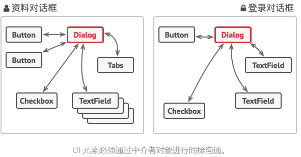

# 中介者模式（Mediator）

中介者模式是一种行为设计模式， 能让你减少对象之间混乱无序的依赖关系。 该模式会限制对象之间的直接交互， 迫使它们通过一个中介者对象进行合作。



## 中介者模式结构


1. **组件** （Component） 是各种包含业务逻辑的类。 每个组件都有一个指向中介者的引用， 该引用被声明为中介者接口类型。 组件不知道中介者实际所属的类， 因此你可通过将其连接到不同的中介者以使其能在其他程序中复用。
1. **中介者** （Mediator） 接口声明了与组件交流的方法， 但通常仅包括一个通知方法。 组件可将任意上下文 （包括自己的对象） 作为该方法的参数， 只有这样接收组件和发送者类之间才不会耦合。
1. **具体中介者** （Concrete Mediator） 封装了多种组件间的关系。 具体中介者通常会保存所有组件的引用并对其进行管理， 甚至有时会对其生命周期进行管理。
1. 组件并不知道其他组件的情况。 如果组件内发生了重要事件， 它只能通知中介者。 中介者收到通知后能轻易地确定发送者， 这或许已足以判断接下来需要触发的组件了。
对于组件来说， 中介者看上去完全就是一个黑箱。 发送者不知道最终会由谁来处理自己的请求， 接收者也不知道最初是谁发出了请求。

## 适用场景

- 当一些对象和其他对象紧密耦合以致难以对其进行修改时， 可使用中介者模式。
- 当组件因过于依赖其他组件而无法在不同应用中复用时， 可使用中介者模式。
- 如果为了能在不同情景下复用一些基本行为， 导致你需要被迫创建大量组件子类时， 可使用中介者模式。

## 优缺点

| 优点                                                                        | 缺点                                         |
| --------------------------------------------------------------------------- | -------------------------------------------- |
| 单一职责原则。你可以将多个组件间的交流抽取到同一位置， 使其更易于理解和维护 | 一段时间后，中介者可能会演化成为**上帝对象** |
| 开闭原则。你无需修改实际组件就能增加新的中介者                              |                                              |
| 你可以减轻应用中多个组件间的耦合情况                                        |                                              |
| 你可以更方便地复用各个组件                                                  |                                              |

## 代码示例

```csharp
using System;

namespace RefactoringGuru.DesignPatterns.Mediator.Conceptual
{
    // The Mediator interface declares a method used by components to notify the
    // mediator about various events. The Mediator may react to these events and
    // pass the execution to other components.
    public interface IMediator
    {
        void Notify(object sender, string ev);
    }

    // Concrete Mediators implement cooperative behavior by coordinating several
    // components.
    class ConcreteMediator : IMediator
    {
        private Component1 _component1;

        private Component2 _component2;

        public ConcreteMediator(Component1 component1, Component2 component2)
        {
            this._component1 = component1;
            this._component1.SetMediator(this);
            this._component2 = component2;
            this._component2.SetMediator(this);
        } 

        public void Notify(object sender, string ev)
        {
            if (ev == "A")
            {
                Console.WriteLine("Mediator reacts on A and triggers following operations:");
                this._component2.DoC();
            }
            if (ev == "D")
            {
                Console.WriteLine("Mediator reacts on D and triggers following operations:");
                this._component1.DoB();
                this._component2.DoC();
            }
        }
    }

    // The Base Component provides the basic functionality of storing a
    // mediator's instance inside component objects.
    class BaseComponent
    {
        protected IMediator _mediator;

        public BaseComponent(IMediator mediator = null)
        {
            this._mediator = mediator;
        }

        public void SetMediator(IMediator mediator)
        {
            this._mediator = mediator;
        }
    }

    // Concrete Components implement various functionality. They don't depend on
    // other components. They also don't depend on any concrete mediator
    // classes.
    class Component1 : BaseComponent
    {
        public void DoA()
        {
            Console.WriteLine("Component 1 does A.");

            this._mediator.Notify(this, "A");
        }

        public void DoB()
        {
            Console.WriteLine("Component 1 does B.");

            this._mediator.Notify(this, "B");
        }
    }

    class Component2 : BaseComponent
    {
        public void DoC()
        {
            Console.WriteLine("Component 2 does C.");

            this._mediator.Notify(this, "C");
        }

        public void DoD()
        {
            Console.WriteLine("Component 2 does D.");

            this._mediator.Notify(this, "D");
        }
    }
    
    class Program
    {
        static void Main(string[] args)
        {
            // The client code.
            Component1 component1 = new Component1();
            Component2 component2 = new Component2();
            new ConcreteMediator(component1, component2);

            Console.WriteLine("Client triggers operation A.");
            component1.DoA();

            Console.WriteLine();

            Console.WriteLine("Client triggers operation D.");
            component2.DoD();
        }
    }
}
```
