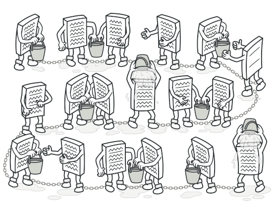
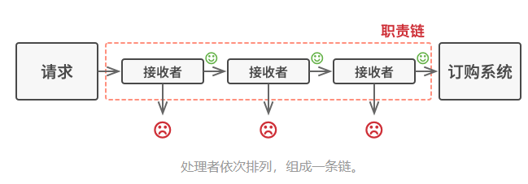

# 责任链模式（Chain of Responsibility）

**责任链模式**是一种行为设计模式， 允许你将请求沿着处理者链进行发送。 收到请求后， 每个处理者均可对请求进行处理， 或将其传递给链上的下个处理者。



处理者会在进行请求处理工作后决定是否继续沿着链传递请求。

#### 个人理解

就是将多个处理方法串起来，形成一个单向传递的链表，不过每个处理方法都可以判断自己能否处理，从而决定是否要继续传递下去。
> md，网站上的那个伪代码给小爷整懵了，把组合模式和责任链模式搞混了。

## 责任链模式结构


1. **处理者** （Handler） 声明了所有具体处理者的通用接口。 该接口通常仅包含单个方法用于请求处理， 但有时其还会包含一个设置链上下个处理者的方法。
1. **基础处理者** （Base Handler） 是一个可选的类， 你可以将所有处理者共用的样本代码放置在其中。
通常情况下， 该类中定义了一个保存对于下个处理者引用的成员变量。 客户端可通过将处理者传递给上个处理者的构造函数或设定方法来创建链。 该类还可以实现默认的处理行为： *确定下个处理者存在后再将请求传递给它。*
1. **具体处理者** （Concrete Handlers） 包含处理请求的实际代码。 每个处理者接收到请求后， 都必须决定是否进行处理， 以及是否沿着链传递请求。
处理者通常是独立且不可变的， 需要通过构造函数一次性地获得所有必要地数据。
1. **客户端** （Client） 可根据程序逻辑一次性或者动态地生成链。 值得注意的是， 请求可发送给链上的任意一个处理者， 而非必须是第一个处理者。

## 适用场景

- 当程序需要使用不同方式处理不同种类请求， 而且请求类型和顺序预先未知时， 可以使用责任链模式。该模式能将多个处理者连接成一条链。接收到请求后，它会 “询问” 每个处理者是否能够对其进行处理。这样所有处理者都有机会来处理请求。
- 当必须按顺序执行多个处理者时， 可以使用该模式。
- 如果所需处理者及其顺序必须在运行时进行改变， 可以使用责任链模式。

## 优缺点

| 优点                                                        | 缺点                 |
| ----------------------------------------------------------- | -------------------- |
| 你可以控制请求处理的顺序                                    | 部分请求可能未被处理 |
| 单一职责原则。 你可对发起操作和执行操作的类进行解耦         |                      |
| 开闭原则。 你可以在不更改现有代码的情况下在程序中新增处理者 |                      |

#### 代码示例

```csharp
using System;
using System.Collections.Generic;

namespace RefactoringGuru.DesignPatterns.ChainOfResponsibility.Conceptual
{
    // The Handler interface declares a method for building the chain of
    // handlers. It also declares a method for executing a request.
    public interface IHandler
    {
        IHandler SetNext(IHandler handler);
        
        object Handle(object request);
    }

    // The default chaining behavior can be implemented inside a base handler
    // class.
    abstract class AbstractHandler : IHandler
    {
        private IHandler _nextHandler;

        public IHandler SetNext(IHandler handler)
        {
            this._nextHandler = handler;
            
            // Returning a handler from here will let us link handlers in a
            // convenient way like this:
            // monkey.SetNext(squirrel).SetNext(dog);
            return handler;
        }
        
        public virtual object Handle(object request)
        {
            if (this._nextHandler != null)
            {
                return this._nextHandler.Handle(request);
            }
            else
            {
                return null;
            }
        }
    }

    class MonkeyHandler : AbstractHandler
    {
        public override object Handle(object request)
        {
            if ((request as string) == "Banana")
            {
                return $"Monkey: I'll eat the {request.ToString()}.\n";
            }
            else
            {
                return base.Handle(request);
            }
        }
    }

    class SquirrelHandler : AbstractHandler
    {
        public override object Handle(object request)
        {
            if (request.ToString() == "Nut")
            {
                return $"Squirrel: I'll eat the {request.ToString()}.\n";
            }
            else
            {
                return base.Handle(request);
            }
        }
    }

    class DogHandler : AbstractHandler
    {
        public override object Handle(object request)
        {
            if (request.ToString() == "MeatBall")
            {
                return $"Dog: I'll eat the {request.ToString()}.\n";
            }
            else
            {
                return base.Handle(request);
            }
        }
    }

    class Client
    {
        // The client code is usually suited to work with a single handler. In
        // most cases, it is not even aware that the handler is part of a chain.
        public static void ClientCode(AbstractHandler handler)
        {
            foreach (var food in new List<string> { "Nut", "Banana", "Cup of coffee" })
            {
                Console.WriteLine($"Client: Who wants a {food}?");

                var result = handler.Handle(food);

                if (result != null)
                {
                    Console.Write($"   {result}");
                }
                else
                {
                    Console.WriteLine($"   {food} was left untouched.");
                }
            }
        }
    }

    class Program
    {
        static void Main(string[] args)
        {
            // The other part of the client code constructs the actual chain.
            var monkey = new MonkeyHandler();
            var squirrel = new SquirrelHandler();
            var dog = new DogHandler();

            monkey.SetNext(squirrel).SetNext(dog);

            // The client should be able to send a request to any handler, not
            // just the first one in the chain.
            Console.WriteLine("Chain: Monkey > Squirrel > Dog\n");
            Client.ClientCode(monkey);
            Console.WriteLine();

            Console.WriteLine("Subchain: Squirrel > Dog\n");
            Client.ClientCode(squirrel);
        }
    }
}
```
