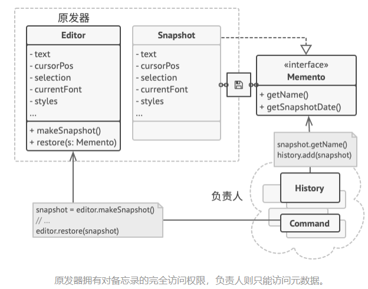
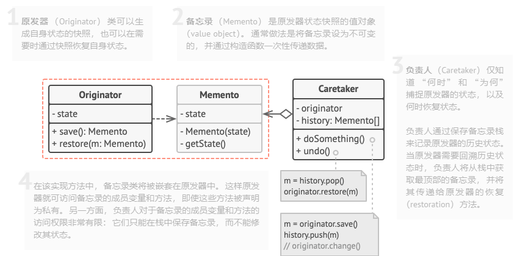

# 备忘录模式（Memento）

**备忘录模式**是一种行为设计模式， 允许在不暴露对象实现细节的情况下保存和恢复对象之前的状态。

> 如何生成一个快照呢？ 很可能你会需要遍历对象的所有成员变量并将其数值复制保存。 但只有当对象对其内容没有严格访问权限限制的情况下， 你才能使用该方式。 不过很遗憾， 绝大部分对象会使用私有成员变量来存储重要数据， 这样别人就无法轻易查看其中的内容。



> 备忘录模式将创建状态快照 （Snapshot） 的工作委派给**实际状态的拥有者原发器 （Originator） 对象**。 这样其他对象就不再需要从 “外部” 复制编辑器状态了， 编辑器类拥有其状态的完全访问权， 因此可以自行生成快照。

> 模式建议将对象状态的副本存储在一个名为备忘录 （Memento） 的特殊对象中。 除了创建备忘录的对象外， 任何对象都不能访问备忘录的内容。 其他对象必须使用受限接口与备忘录进行交互， 它们可以获取快照的元数据 （创建时间和操作名称等）， 但不能获取快照中原始对象的状态。

> 这种限制策略允许你将备忘录保存在通常被称为负责人 （Caretakers） 的对象中。 由于负责人仅通过受限接口与备忘录互动， 故其无法修改存储在备忘录内部的状态。 同时， 原发器拥有对备忘录所有成员的访问权限， 从而能随时恢复其以前的状态。

## 备忘录模式结构

##### 基于嵌套类的实现

该模式的经典实现方式依赖于许多流行编程语言 （例如 C++、 C# 和 Java） 所支持的嵌套类。



1. **原发器** （Originator） 类可以生成自身状态的快照， 也可以在需要时通过快照恢复自身状态。
1. **备忘录** （Memento） 是原发器状态快照的值对象 （value object）。 通常做法是将备忘录设为不可变的， 并通过构造函数一次性传递数据。
1. **负责人** （Caretaker） 仅知道 “何时” 和 “为何” 捕捉原发器的状态， 以及何时恢复状态。
负责人通过保存备忘录栈来记录原发器的历史状态。 当原发器需要回溯历史状态时， 负责人将从栈中获取最顶部的备忘录， 并将其传递给原发器的恢复 （restoration） 方法。
1. 在该实现方法中， 备忘录类将被嵌套在原发器中。 这样原发器就可访问备忘录的成员变量和方法， 即使这些方法被声明为私有。 另一方面， 负责人对于备忘录的成员变量和方法的访问权限非常有限： 它们只能在栈中保存备忘录， 而不能修改其状态。

##### 基于中间接口的实现

另外一种实现方法适用于不支持嵌套类的编程语言


1. 在没有嵌套类的情况下， 你可以规定负责人仅可通过明确声明的中间接口与备忘录互动， 该接口仅声明与备忘录元数据相关的方法， 限制其对备忘录成员变量的直接访问权限。
1. 另一方面， 原发器可以直接与备忘录对象进行交互， 访问备忘录类中声明的成员变量和方法。 这种方式的缺点在于你需要将备忘录的所有成员变量声明为公有。

##### 封装更加严格的实现

如果你不想让其他类有任何机会通过备忘录来访问原发器的状态， 那么还有另一种可用的实现方式。(可以实现管理不同原发器的快照)


1. 这种实现方式允许存在多种不同类型的原发器和备忘录。 每种原发器都和其相应的备忘录类进行交互。 原发器和备忘录都不会将其状态暴露给其他类。
1. 负责人此时被明确禁止修改存储在备忘录中的状态。 但负责人类将独立于原发器， 因为此时恢复方法被定义在了备忘录类中。
1. 每个备忘录将与创建了自身的原发器连接。 原发器会将自己及状态传递给备忘录的构造函数。 由于这些类之间的紧密联系， 只要原发器定义了合适的设置器 （setter）， 备忘录就能恢复其状态。

## 优缺点

| 优点                                                     | 缺点                                                                                    |
| -------------------------------------------------------- | --------------------------------------------------------------------------------------- |
| 你可以在不破坏对象封装情况的前提下创建对象状态快照       | 如果客户端过于频繁地创建备忘录， 程序将消耗大量内存                                     |
| 你可以通过让负责人维护原发器状态历史记录来简化原发器代码 | 负责人必须完整跟踪原发器的生命周期， 这样才能销毁弃用的备忘录                           |
|                                                          | 绝大部分动态编程语言 （例如 PHP、 Python 和 JavaScript） 不能确保备忘录中的状态不被修改 |

#### 示例代码

```csharp
// 原发器中包含了一些可能会随时间变化的重要数据。它还定义了在备忘录中保存
// 自身状态的方法，以及从备忘录中恢复状态的方法。
class Editor is
    private field text, curX, curY, selectionWidth

    method setText(text) is
        this.text = text

    method setCursor(x, y) is
        this.curX = x
        this.curY = y

    method setSelectionWidth(width) is
        this.selectionWidth = width

    // 在备忘录中保存当前的状态。
    method createSnapshot():Snapshot is
        // 备忘录是不可变的对象；因此原发器会将自身状态作为参数传递给备忘
        // 录的构造函数。
        return new Snapshot(this, text, curX, curY, selectionWidth)

// 备忘录类保存有编辑器的过往状态。
class Snapshot is
    private field editor: Editor
    private field text, curX, curY, selectionWidth

    constructor Snapshot(editor, text, curX, curY, selectionWidth) is
        this.editor = editor
        this.text = text
        this.curX = x
        this.curY = y
        this.selectionWidth = selectionWidth

    // 在某一时刻，编辑器之前的状态可以使用备忘录对象来恢复。
    method restore() is
        editor.setText(text)
        editor.setCursor(curX, curY)
        editor.setSelectionWidth(selectionWidth)

// 命令对象可作为负责人。在这种情况下，命令会在修改原发器状态之前获取一个
// 备忘录。当需要撤销时，它会从备忘录中恢复原发器的状态。
class Command is
    private field backup: Snapshot

    method makeBackup() is
        backup = editor.createSnapshot()

    method undo() is
        if (backup != null)
            backup.restore()
    // ……
```