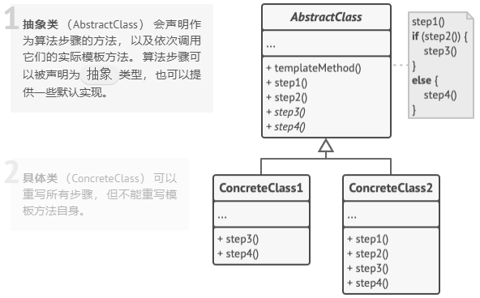

# 模板方法模式（Template Method）

**模板方法模式**是一种行为设计模式， 它在超类中定义了一个算法的框架， 允许子类在不修改结构的情况下重写算法的特定步骤。

模板方法模式建议将流程算法分解为一系列步骤， 然后将这些步骤改写为方法， 最后在 “模板方法” 中依次调用这些方法。 步骤可以是 抽象的， 也可以有一些默认的实现。 为了能够使用算法， 客户端需要自行提供子类并实现所有的抽象步骤。 如有必要还需重写一些步骤 （但这一步中不包括模板方法自身）。

#### 其他概念

###### 钩子

**钩子（Hook）** 是一种特殊的方法，定义在抽象父类中，用于在算法流程中提供可扩展的 “钩子点”，允许子类根据需要选择性地覆盖或补充算法的某些步骤。

**作用**

1. **提供默认行为**：钩子方法通常有一个默认实现（可以是空实现），子类可以不必强制重写。
2. **控制算法流程**：子类通过重写钩子方法，能够影响父类中模板方法的执行逻辑（例如条件判断）。
3. **增强灵活性**：在不改变模板方法骨架的前提下，让子类能够定制算法中的特定步骤。

**示例代码**

```java
// 抽象父类（定义模板方法和钩子）
abstract class AbstractClass {
    // 模板方法：定义算法骨架
    public final void templateMethod() {
        step1();
        // 调用钩子方法
        if (hookMethod()) { 
            step2(); 
        }
        step3();
    }
    
    protected abstract void step1(); // 抽象步骤（必须实现）
    protected abstract void step3(); // 抽象步骤（必须实现）
    
    protected void step2() { 
        // 可选步骤（默认实现）
    }
    
    // 钩子方法：默认返回true，子类可重写
    protected boolean hookMethod() {
        return true; 
    }
}

// 子类实现
class ConcreteClass extends AbstractClass {
    @Override
    protected void step1() {
        System.out.println("执行步骤1");
    }
    
    @Override
    protected void step3() {
        System.out.println("执行步骤3");
    }
    
    // 重写钩子方法，改变算法流程
    @Override
    protected boolean hookMethod() {
        // 根据业务逻辑决定是否执行step2
        return false; 
    }
}
```

## 模板方法模式结构



1. **抽象类** （Abstract­Class） 会声明作为算法步骤的方法， 以及依次调用它们的实际模板方法。 算法步骤可以被声明为 `抽象`类型， 也可以提供一些默认实现。
1. **具体类** （Concrete­Class） 可以重写所有步骤， 但不能重写模板方法自身。

## 优缺点

| 优点                                                                                  | 缺点                                               |
| ------------------------------------------------------------------------------------- | -------------------------------------------------- |
| 可仅允许客户端重写一个大型算法中的特定部分， 使得算法其他部分修改对其所造成的影响减小 | 部分客户端可能会受到算法框架的限制                 |
| 可将重复代码提取到一个超类中                                                          | 通过子类抑制默认步骤实现可能会导致违反里氏替换原则 |
|                                                                                       | 模板方法中的步骤越多， 其维护工作就可能会越困难    |


#### 示例代码

```csharp
using System;

namespace RefactoringGuru.DesignPatterns.TemplateMethod.Conceptual
{
    // The Abstract Class defines a template method that contains a skeleton of
    // some algorithm, composed of calls to (usually) abstract primitive
    // operations.
    //
    // Concrete subclasses should implement these operations, but leave the
    // template method itself intact.
    abstract class AbstractClass
    {
        // The template method defines the skeleton of an algorithm.
        public void TemplateMethod()
        {
            this.BaseOperation1();
            this.RequiredOperations1();
            this.BaseOperation2();
            this.Hook1();
            this.RequiredOperation2();
            this.BaseOperation3();
            this.Hook2();
        }

        // These operations already have implementations.
        protected void BaseOperation1()
        {
            Console.WriteLine("AbstractClass says: I am doing the bulk of the work");
        }

        protected void BaseOperation2()
        {
            Console.WriteLine("AbstractClass says: But I let subclasses override some operations");
        }

        protected void BaseOperation3()
        {
            Console.WriteLine("AbstractClass says: But I am doing the bulk of the work anyway");
        }
        
        // These operations have to be implemented in subclasses.
        protected abstract void RequiredOperations1();

        protected abstract void RequiredOperation2();
        
        // These are "hooks." Subclasses may override them, but it's not
        // mandatory since the hooks already have default (but empty)
        // implementation. Hooks provide additional extension points in some
        // crucial places of the algorithm.
        protected virtual void Hook1() { }

        protected virtual void Hook2() { }
    }

    // Concrete classes have to implement all abstract operations of the base
    // class. They can also override some operations with a default
    // implementation.
    class ConcreteClass1 : AbstractClass
    {
        protected override void RequiredOperations1()
        {
            Console.WriteLine("ConcreteClass1 says: Implemented Operation1");
        }

        protected override void RequiredOperation2()
        {
            Console.WriteLine("ConcreteClass1 says: Implemented Operation2");
        }
    }

    // Usually, concrete classes override only a fraction of base class'
    // operations.
    class ConcreteClass2 : AbstractClass
    {
        protected override void RequiredOperations1()
        {
            Console.WriteLine("ConcreteClass2 says: Implemented Operation1");
        }

        protected override void RequiredOperation2()
        {
            Console.WriteLine("ConcreteClass2 says: Implemented Operation2");
        }

        protected override void Hook1()
        {
            Console.WriteLine("ConcreteClass2 says: Overridden Hook1");
        }
    }

    class Client
    {
        // The client code calls the template method to execute the algorithm.
        // Client code does not have to know the concrete class of an object it
        // works with, as long as it works with objects through the interface of
        // their base class.
        public static void ClientCode(AbstractClass abstractClass)
        {
            // ...
            abstractClass.TemplateMethod();
            // ...
        }
    }

    class Program
    {
        static void Main(string[] args)
        {
            Console.WriteLine("Same client code can work with different subclasses:");

            Client.ClientCode(new ConcreteClass1());

            Console.Write("\n");
            
            Console.WriteLine("Same client code can work with different subclasses:");
            Client.ClientCode(new ConcreteClass2());
        }
    }
}
```